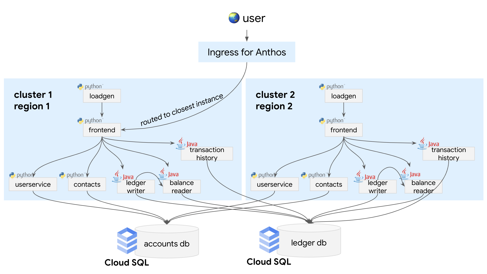

# Multi-cluster Bank of Anthos with Cloud SQL

This doc contains instructions for deploying the Cloud SQL version of Bank of Anthos in a multi-region high availability / global configuration.

The use case for this setup is to demo running a global, scaled app, where even if one cluster goes down, users will be routed to the next available cluster. These instructions also show how to use [Multi-cluster Ingress](https://cloud.google.com/kubernetes-engine/docs/concepts/multi-cluster-ingress) to route users to the closest GKE cluster, demonstrating a low-latency use case.



Note that in this setup, there is no service communication between the two clusters/regions. Each cluster has a dedicated frontend and set of backends. Both regions, however, share the same Cloud SQL instance, which houses the two databases (Accounts and Ledger).

For an HTTPS setup using self-managed certs, [see the HTTPS section](#https-option) at the bottom of this page. 

## Prerequisites

Install the kubectx command line tool

Anthos license

## Steps (HTTP)

1. **Create a [Google Cloud project](https://cloud.google.com/resource-manager/docs/creating-managing-projects)** if you don't already have one.

2. **Set environment variables**, where `DB_REGION` is where the Cloud SQL instance will be deployed


```
export PROJECT_ID="my-project"
export DB_REGION="us-central1"
export CLUSTER_1_NAME="boa-1"
export CLUSTER_1_ZONE="us-central1-b"
export CLUSTER_2_NAME="boa-2"
export CLUSTER_2_ZONE="europe-west3-a"
export NAMESPACE="default"
```

3. **Create two GKE clusters, one per region.**

```
gcloud container clusters create ${CLUSTER_1_NAME} \
	--project=${PROJECT_ID} --zone=${CLUSTER_1_ZONE} \
	--machine-type=e2-standard-4 --num-nodes=4 \
	--workload-pool="${PROJECT_ID}.svc.id.goog" --enable-ip-alias

gcloud container clusters create ${CLUSTER_2_NAME} \
	--project=${PROJECT_ID} --zone=${CLUSTER_2_ZONE} \
	--machine-type=e2-standard-4 --num-nodes=4 \
	--workload-pool="${PROJECT_ID}.svc.id.goog" --enable-ip-alias
```

4. **Configure kubectx for the clusters.**

```
gcloud container clusters get-credentials ${CLUSTER_1_NAME} --zone ${CLUSTER_1_ZONE} --project ${PROJECT_ID}
kubectx cluster1="gke_${PROJECT_ID}_${CLUSTER_1_ZONE}_${CLUSTER_1_NAME}"

gcloud container clusters get-credentials ${CLUSTER_2_NAME} --zone ${CLUSTER_2_ZONE} --project ${PROJECT_ID}
kubectx cluster2="gke_${PROJECT_ID}_${CLUSTER_2_ZONE}_${CLUSTER_2_NAME}"
```

5. **Set up Workload Identity** for both clusters. When the script is run for the second time, you'll see some errors (GCP service account already exists), this is ok.

```
kubectx cluster1
../cloudsql/setup_workload_identity.sh

kubectx cluster2
../cloudsql/setup_workload_identity.sh
```

6. **Run the Cloud SQL instance create script** on both clusters. You'll see errors when running on the second cluster, this is ok.

```
../cloudsql/create_cloudsql_instance.sh
```

7. **Create Cloud SQL admin secrets** in your GKE clusters. This gives your in-cluster Cloud SQL clients a username and password to access Cloud SQL. (Note that admin/admin credentials are for demo use only and should never be used in a production environment.)

```
INSTANCE_NAME='bank-of-anthos-db-multi'
INSTANCE_CONNECTION_NAME=$(gcloud sql instances describe $INSTANCE_NAME --format='value(connectionName)')

kubectx cluster1
kubectl create secret -n ${NAMESPACE} generic cloud-sql-admin \
 --from-literal=username=admin --from-literal=password=admin \
 --from-literal=connectionName=${INSTANCE_CONNECTION_NAME}

kubectx cluster2
kubectl create secret -n ${NAMESPACE} generic cloud-sql-admin \
 --from-literal=username=admin --from-literal=password=admin \
 --from-literal=connectionName=${INSTANCE_CONNECTION_NAME}
```


8. **Deploy the DB population jobs.**  These are one-off bash scripts that initialize the Accounts and Ledger databases with data. You only need to run these Jobs once, so we deploy them only to cluster1.

```
kubectx cluster1
kubectl apply  -n ${NAMESPACE} -f ../cloudsql/kubernetes-manifests/config.yaml
kubectl apply -n ${NAMESPACE} -f ../cloudsql/populate-jobs
```

9. Wait a few minutes for the Jobs to complete. The Pods will be marked as  `0/3 - Completed` when they finish successfully.

```
NAME                         READY   STATUS      RESTARTS   AGE
populate-accounts-db-js8lw   0/3     Completed   0          71s
populate-ledger-db-z9p2g     0/3     Completed   0          70s
```

10. **Deploy Bank of Anthos services to both clusters.**

```
kubectx cluster1
kubectl apply  -n ${NAMESPACE} -f ../cloudsql/kubernetes-manifests

kubectx cluster2
kubectl apply  -n ${NAMESPACE} -f ../cloudsql/kubernetes-manifests
```

11. **Run the Multi-cluster Ingress setup script.** This registers both GKE clusters to Anthos with "memberships," and sets cluster 1 as the "config cluster" to administer the Multi-cluster Ingress resources.

```
./register_clusters.sh
```


12. **Create Multi-cluster Ingress resources for global routing.**  This YAML file contains two resources a headless Multicluster Kubernetes Service ("MCS") mapped to the `frontend` Pods, and a multi cluster Ingress resource, `frontend-global-ingress`, with `frontend-mcs` as the MCS backend. Note that we're only deploying this to Cluster 1, which we've designated as the multicluster ingress "config cluster."

```
kubectx cluster1
kubectl apply -n ${NAMESPACE} -f multicluster-ingress.yaml
```


13. **Verify that the multicluster ingress resource was created.** Look for the `Status` field to be populated with two Network Endpoint Groups (NEGs) corresponding to the regions where your 2 GKE clusters are running. This may take a few minutes.

```
watch kubectl describe mci frontend-global-ingress -n ${NAMESPACE}
```

Expected output:

```
Status:
...
    Network Endpoint Groups:
      zones/europe-west3-a/networkEndpointGroups/k8s1-dd9eb2b0-defaul-mci-frontend-mcs-svc-0xt1kovs-808-7e472f17
      zones/us-west1-b/networkEndpointGroups/k8s1-6d3d6f1b-defaul-mci-frontend-mcs-svc-0xt1kovs-808-79d9ace0
    Target Proxies:
      mci-ddwsrr-default-frontend-global-ingress
    URL Map:  mci-ddwsrr-default-frontend-global-ingress
  VIP:        34.120.172.105
```


14. **Copy the `VIP` field** to the clipboard and set as an env variable:

```
export VIP=<your-VIP>
```

15. **Test the geo-aware routing** by curling the `/whereami` frontend endpoint using the global VIP you copied. You could also create a Google Compute Engine instance in a specific region to test further. **Note that you may see a `404` or `502` error** for several minutes while the forwarding rules propagate.

```
watch curl http://${VIP}:80/whereami
```

Example output, from a US-based client where the two GKE regions are `us-west1` and `europe-west3-a`:

```
Cluster: boa-1, Pod: frontend-74675b56f-w4rdf, Zone: us-west1-b
```

Example output, from an EU-based GCE instance:

```
Cluster: boa-2, Pod: frontend-74675b56f-2ln5w, Zone: europe-west3-a
```

🎉 **Congrats!** You just deployed a globally-available version of Bank of Anthos!


## HTTPS Option 

https://cloud.google.com/kubernetes-engine/docs/how-to/multi-cluster-ingress#https_support 

1. Create a global static IP, `mci-ip`. 

```
gcloud compute addresses create mci-ip --global
```

2. Create a self-signed SSL certificate. 

```
openssl req -x509 -newkey rsa:4096 -keyout key.pem -out cert.pem -days 365
```

3. Create a Kubernetes secret, `mci-tls`, from your SSL certificate. 

```
kubectl -n prod create secret mci-tls secret-name --key `pwd`/key.pem --cert `pwd`/cert.pem
```

Follow the rest of the instructions in the HTTP section. The only difference is that when you reach the section where you deploy `multicluster-ingress.yaml`, **instead deploy `multicluster-ingress-https.yaml`.** This updated MCI resource points to the static IP and cert secret you created. 

For more information, see the [Multi-cluster ingress docs](https://cloud.google.com/kubernetes-engine/docs/how-to/multi-cluster-ingress#https_support). 